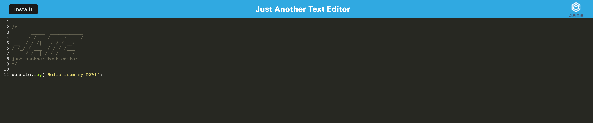

# PWA-Text-Editor

 ## Table of Contents
 - [Project Description](#Description)
 - [Usage](#Usage)
 - [Installation](#Installation)
 - [Contribution](#Contribution)
 - [GitHub](#GitHub)
 - [Email](#Email)
 - [License](#License)
  
## Description
This application is a PWA Text Editor. With this application you can run it in your browser or when you are offline you can use this just like you would any text editor. 

Leave notes for yourself for later, practice writing your functions. 

With this application some of the code was already created and what I needed to do was download all the necessary dependencies. Then I finished the `put` route and the `get` route. 

## Usage
Download the code from the GitHub repository, then run `npm install` to get all the dependencies, then `npm run start` to start the application.

## Technologies

## Installation
Install Node.js & run `npm  install` for all of the packages needed.

## Contribution
Currently there are no contributions being taken.

## Resources

Deployed Site:
https://pwa--text-editor.herokuapp.com/

Screenshots:

## GitHub
Christianmsm: https://github.com/Christianmsm

Repository: https://github.com/Christianmsm/PWA-Text-Editor
## Email
hello@itschristiansmith.com
## License
Licensed with: https://opensource.org/license/mit/